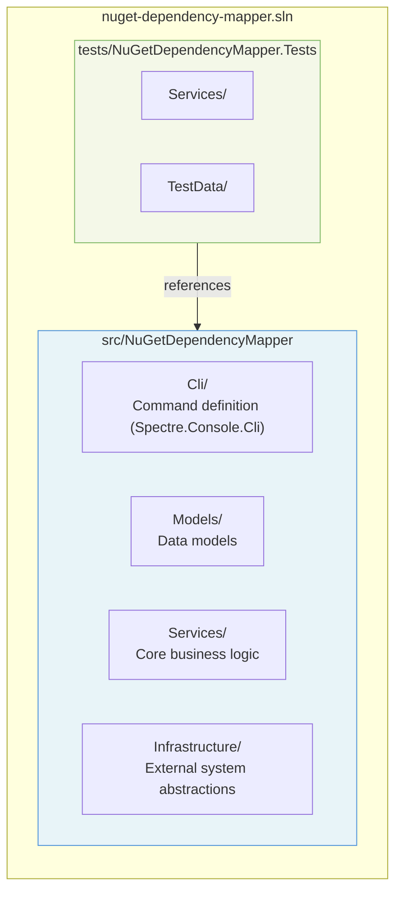
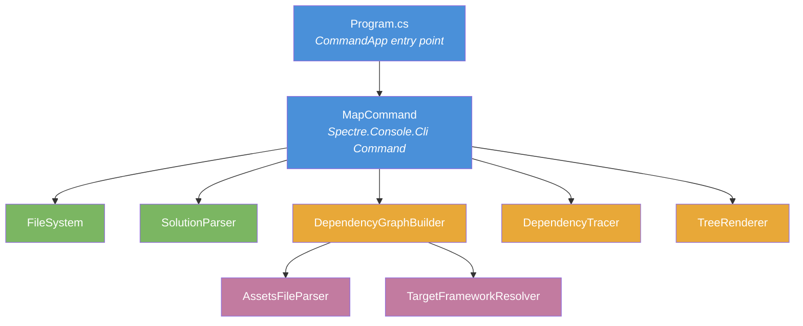
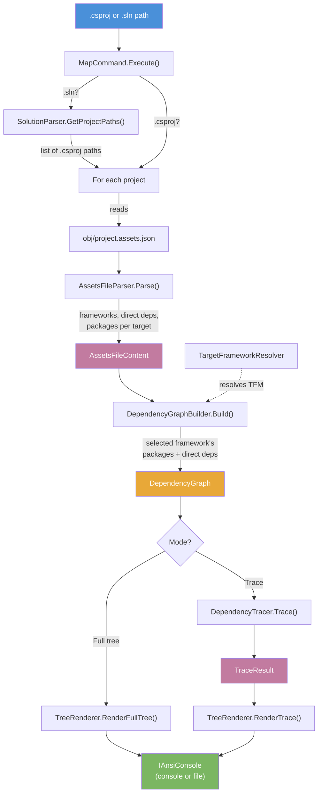

# Architecture Overview

## Solution Structure

## Component Diagram

## Data Flow

## Key Models

| Model | Purpose |
|-------|---------|
| `PackageInfo` | A resolved package: name, version, and its immediate dependencies |
| `DependencyGraph` | Complete graph for one framework: project name, direct deps, all packages |
| `AssetsFileContent` | Raw parsed data from project.assets.json, before framework selection |
| `TraceResult` | All dependency paths leading to a specific target package |
| `DependencyPath` | A single chain from a direct dependency down to the target |

## Services

### MapCommand (Cli)
The Spectre.Console.Cli `Command<Settings>` that serves as the application entry point. Defines CLI arguments and options as typed properties with built-in validation. Orchestrates the full workflow: file resolution, graph building, and rendering. Handles both console output (with colors) and file export (plain text) via `IAnsiConsole`.

### SolutionParser
Extracts `.csproj` project paths from `.sln` files using regex matching against the standard Visual Studio solution file format. Resolves relative paths against the solution directory. Filters out solution folders and non-C# projects.

### AssetsFileParser
Parses `project.assets.json` using `System.Text.Json`. Extracts available frameworks, direct dependencies per framework, and all resolved packages per target. Operates purely on JSON structure — no policy decisions.

### TargetFrameworkResolver
Resolves framework monikers to target keys. Handles the mismatch between short aliases (`net48`) and long-form keys (`.NETFramework,Version=v4.8`) used in the targets section. Uses a 5-step matching cascade: exact match, starts-with, short-to-long conversion, reverse match, single-target fallback.

### DependencyGraphBuilder
Orchestrates the parsing and framework selection. Depends on `IAssetsFileParser` and `ITargetFrameworkResolver`. Produces a `DependencyGraph` ready for rendering or tracing.

### DependencyTracer
Finds all dependency paths from direct dependencies to a specified target package using recursive depth-first search with cycle detection. Returns a `TraceResult` with all paths found.

### TreeRenderer
Renders dependency trees using Spectre.Console's `Tree` widget for color-coded, properly formatted output. Uses `Panel` with rounded borders for trace headers and `Rule` for project separators. Supports two modes: full tree (shows all packages with their transitive deps) and trace mode (shows numbered paths to a target package with tree connectors).

## Design Decisions

### Why Spectre.Console?
Spectre.Console provides rich terminal rendering (colored trees, panels, rules) and a typed CLI framework with auto-generated help — replacing the hand-rolled `CliParser` and plain-text `TreeRenderer`. File export uses `IAnsiConsole` with colors disabled for clean plain-text output.

### Why DI in a CLI tool?
Dependency injection via `Microsoft.Extensions.DependencyInjection` enables clean separation of concerns and makes services independently testable. The container is built once, used once, and disposed — no overhead complexity.

### Why IFileSystem?
The file system abstraction is the only "test seam" introduced. It keeps the command testable in isolation and prevents services from having implicit file system dependencies. Console output uses injectable `IAnsiConsole` parameters.

### Why separate AssetsFileParser from DependencyGraphBuilder?
The parser handles JSON structure (which properties to read, how to split `"PackageName/Version"` keys). The builder handles policy (framework selection, sorting, validation). This separation means parser tests use real JSON fixtures, while builder tests use mocks.
